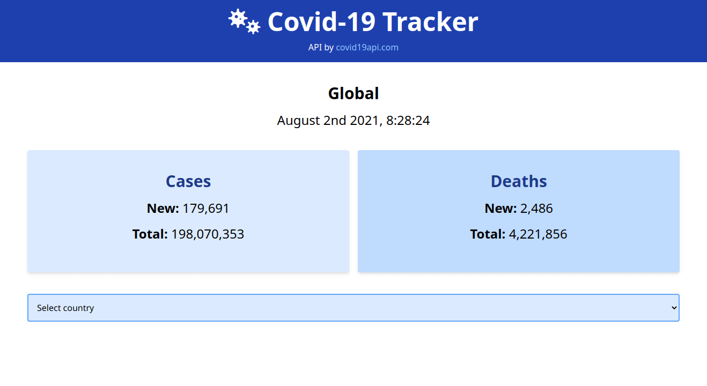

# Vue Covid Tracker



## About the project

That project was develop based on a [Traversy Media](https://www.youtube.com/user/TechGuyWeb)'s video (you can see it [here](https://www.youtube.com/watch?v=m-MAIpnH9ag)).
It's a simples covid-19 information tracker built with [Vue 3](https://v3.vuejs.org/) and [Tailwind CSS](https://tailwindcss.com/) with data served by [covid19api.com](https://covid19api.com).

## Project setup
```bash
yarn install
```

### Compiles and hot-reloads for development
```bash
yarn serve
```

### Compiles and minifies for production
```bash
yarn build
```

### Customize configuration
See [Configuration Reference](https://cli.vuejs.org/config/).